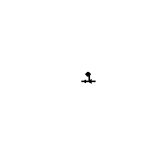
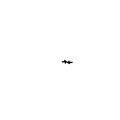
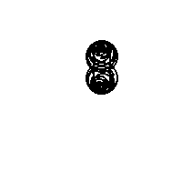
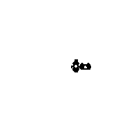
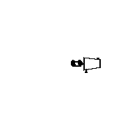

# Approved P&ID Symbol Gallery

This gallery contains visual previews of all approved P&ID symbols.

---

## Instrument Bubble

| # | Symbol ID | Preview | Source | Status |
|---|-----------|---------|--------|--------|
| 001 | board_mounted_instrument |  | `3_primary-accesible-discrete-instrument.dxf` | OK |
| 002 | field_instrument |  | `0_field-mounted-discrete-instrument.dxf` | OK |
| 003 | field_mounted_instrument |  | `0_field-mounted-discrete-instrument.dxf` | OK |
| 004 | local_instrument |  | `0_field-mounted-discrete-instrument.dxf` | OK |
| 005 | panel_instrument |  | `3_primary-accesible-discrete-instrument.dxf` | OK |
| 006 | primary_accessible_instrument |  | `3_primary-accesible-discrete-instrument.dxf` | OK |

## Transmitter

| # | Symbol ID | Preview | Source | Status |
|---|-----------|---------|--------|--------|
| 007 | field_transmitter |  | `0_field-mounted-discrete-instrument.dxf` | OK |
| 008 | process_transmitter |  | `0_field-mounted-discrete-instrument.dxf` | OK |
| 009 | transmitter |  | `0_field-mounted-discrete-instrument.dxf` | OK |

## Controller

| # | Symbol ID | Preview | Source | Status |
|---|-----------|---------|--------|--------|
| 010 | controller |  | `3_primary-accesible-discrete-instrument.dxf` | OK |
| 011 | panel_controller |  | `3_primary-accesible-discrete-instrument.dxf` | OK |
| 012 | pid_controller |  | `3_primary-accesible-discrete-instrument.dxf` | OK |

## Indicator

| # | Symbol ID | Preview | Source | Status |
|---|-----------|---------|--------|--------|
| 013 | indicator |  | `3_primary-accesible-discrete-instrument.dxf` | OK |
| 014 | local_indicator |  | `3_primary-accesible-discrete-instrument.dxf` | OK |
| 015 | panel_indicator |  | `3_primary-accesible-discrete-instrument.dxf` | OK |

## Switch

| # | Symbol ID | Preview | Source | Status |
|---|-----------|---------|--------|--------|
| 016 | flow_switch |  | `0_field-mounted-discrete-instrument.dxf` | OK |
| 017 | pressure_switch |  | `0_field-mounted-discrete-instrument.dxf` | OK |
| 018 | switch |  | `0_field-mounted-discrete-instrument.dxf` | OK |
| 019 | temperature_switch |  | `0_field-mounted-discrete-instrument.dxf` | OK |

## Final Control Element

| # | Symbol ID | Preview | Source | Status |
|---|-----------|---------|--------|--------|
| 020 | actuated_valve |  | `23_control-valve.dxf` | OK |
| 021 | control_valve |  | `23_control-valve.dxf` | OK |
| 022 | pneumatic_control_valve |  | `23_control-valve.dxf` | OK |

## Manual Valve

| # | Symbol ID | Preview | Source | Status |
|---|-----------|---------|--------|--------|
| 023 | ball_valve |  | `0_gate-valve-no.dxf` | OK |
| 024 | butterfly_valve |  | `0_gate-valve-no.dxf` | OK |
| 025 | gate_valve |  | `0_gate-valve-no.dxf` | OK |
| 026 | globe_valve |  | `0_gate-valve-no.dxf` | OK |
| 027 | manual_valve |  | `0_gate-valve-no.dxf` | OK |

## Check Valve

| # | Symbol ID | Preview | Source | Status |
|---|-----------|---------|--------|--------|
| 028 | check_valve |  | `2_check-valve.dxf` | OK |
| 029 | non_return_valve |  | `2_check-valve.dxf` | OK |
| 030 | nrV |  | `2_check-valve.dxf` | OK |

## Vessel

| # | Symbol ID | Preview | Source | Status |
|---|-----------|---------|--------|--------|
| 031 | drum |  | `9_vessel-vertical.dxf` | OK |
| 032 | knockout_drum |  | `9_vessel-vertical.dxf` | OK |
| 033 | separator |  | `9_vessel-vertical.dxf` | OK |
| 034 | tank |  | `9_vessel-vertical.dxf` | OK |
| 035 | vessel |  | `9_vessel-vertical.dxf` | OK |

## Pump

| # | Symbol ID | Preview | Source | Status |
|---|-----------|---------|--------|--------|
| 036 | centrifugal_pump |  | `15_pump-horizontal-centrifugal.dxf` | OK |
| 037 | positive_displacement_pump |  | `15_pump-horizontal-centrifugal.dxf` | OK |
| 038 | pump |  | `15_pump-horizontal-centrifugal.dxf` | OK |

## Compressor

| # | Symbol ID | Preview | Source | Status |
|---|-----------|---------|--------|--------|
| 039 | centrifugal_compressor |  | `25_compressor-centrifugal.dxf` | OK |
| 040 | compressor |  | `25_compressor-centrifugal.dxf` | OK |
| 041 | reciprocating_compressor |  | `25_compressor-centrifugal.dxf` | OK |

## Heat Exchanger

| # | Symbol ID | Preview | Source | Status |
|---|-----------|---------|--------|--------|
| 042 | condenser |  | `32_heat-exchanger-tema-type-bem.dxf` | OK |
| 043 | heat_exchanger |  | `32_heat-exchanger-tema-type-bem.dxf` | OK |
| 044 | reboiler |  | `32_heat-exchanger-tema-type-bem.dxf` | OK |
| 045 | shell_and_tube_exchanger |  | `32_heat-exchanger-tema-type-bem.dxf` | OK |

## Junction Tee

| # | Symbol ID | Preview | Source | Status |
|---|-----------|---------|--------|--------|
| 046 | junction_tee |  | `0_flange.dxf` | OK |
| 047 | pipe_tee |  | `0_flange.dxf` | OK |
| 048 | tee |  | `0_flange.dxf` | OK |

## Junction Cross

| # | Symbol ID | Preview | Source | Status |
|---|-----------|---------|--------|--------|
| 049 | cross |  | `0_flange.dxf` | OK |
| 050 | junction_cross |  | `0_flange.dxf` | OK |
| 051 | pipe_cross |  | `0_flange.dxf` | OK |

## Off Page Connector

| # | Symbol ID | Preview | Source | Status |
|---|-----------|---------|--------|--------|
| 052 | off_page_connector |  | `45_piping-tag.dxf` | OK |
| 053 | offsheet_connector |  | `45_piping-tag.dxf` | OK |
| 054 | page_connector |  | `45_piping-tag.dxf` | OK |

## Termination Point

| # | Symbol ID | Preview | Source | Status |
|---|-----------|---------|--------|--------|
| 055 | blind_flange |  | `9_blank.dxf` | OK |
| 056 | pipeline_termination |  | `9_blank.dxf` | OK |
| 057 | termination_point |  | `9_blank.dxf` | OK |

---

## Summary

- **Total Symbols:** 57
- **OK:** 57
- **Missing Source:** 0
- **Render Failed:** 0

## Files Generated

- `approved_symbol_gallery.png` - Contact sheet with all symbols
- Individual PNG previews: `001_*.png`, `002_*.png`, etc.
- `approved_symbol_manifest.json` - Machine-readable metadata
- `approved_symbol_manifest.md` - Human-readable table